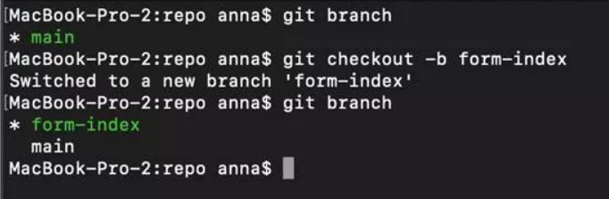

# Мегахакатон 2.0 Команда № 22 (megahackathon_istok_22)

Проект Команды № 22 в Мегахакатоне от Skillfactory в кейсе ISTOK

```
Системные требования:
    > Python 3.11.* или ниже
    > Система контроля версий git 
```

### Принципы работы с репозиторием:
* Склонируйте репозиторий к себе
> git clone https://github.com/juliakarabasova/megahackathon_istok_22.git

* Создайте ветку для работы со своим ником/именем
> git checkout -b _ваше_имя_

* Проверьте, что вы переключены на нужную ветку (отмечена зеленым со звездочкой)
> git branch

>  

* Переключитесь на свою ветку (если еще не на ней)

> git checkout _название_ветки_

### Другие основные git-команды

```commandline
> git status — показывает измененные но не закомиченные/запушенные файлы. 
> git add file — добавить файл в коммит. 
> git add . — добавить все изменённые файлы в коммит. 
> git commit — m ‘text’ — добавить подпись коммитов. 
> git commit —amend — изменения сообщение последнего коммита.
> git push – залить изменения на сервер в текущую ветку.
```

## Чеклист веб-сайта

Разработать сайт компании в соответствие с айдентикой со следующими возможностями: 

- [x] Продумать фреймворк и необходимые для работы компоненты
- [x] Разработать модели данных и их связи
- [x] Страница регистрации
- [x] Вдохновляющий рекламный/информационный баннер;
- [x] Календарь записи на встречу;
- [x] Личный кабинет с системой лояльности, статус заказа, информацию по заказу; 
- [x] Чат поддержки;
- [x] Страница "Каталог мебели";
- [x] Блок с акциями;
- [x] Страница "О нас";
